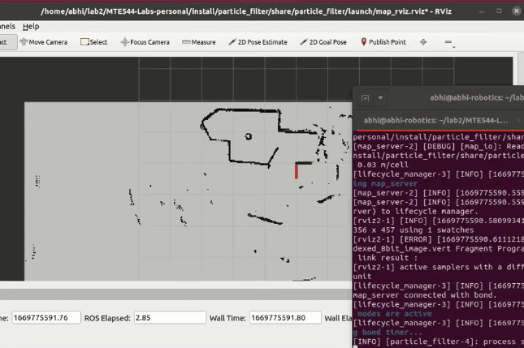

# MTE 544 Lab 3 - Path Planning and Control
> By Group 8, Ayush Ghosh, Nick Shaju, Abhinav Agrahari

This `planner` package implements an A* Planner based on a given map, and a P-controller to autonomously guide the TurtleBot along the determined path. 

> [Click here](https://youtu.be/dRcdahp3rSI) for a Youtube video of the path planner in action!

Pink/Purple/Blue is the inflated costmap. Green is the path the robot autonomously follows

[](https://youtu.be/dRcdahp3rSI)

## Setup
To setup the `mte544_a_star` package, build and source this workspace: 

```bash
rosdep install --from-paths src --ignore-src -r -y
pip install scikit-image
colcon build --symlink-install
source install/setup.bash
```

## Running

In 3 seperate terminals:
- `ros2 launch turtlebot3_gazebo turtlebot3_house.launch.py`
- `ros2 launch mte544_a_star mte544_a_star.launch.py`
- For defining goals in RViz:
  - `ros2 run mte544_a_star mte544_navigation_client.py`
  - Then through RViz, give a `2D Goal Pose`
- For pre-defining a goal from terminal (modify x and y as needed): 
  - `ros2 run mte544_a_star mte544_navigation_client.py --ros-args -p predefined_goal:=True -p goal_x:=4.0 -p goal_y:=0.8`

# MTE 544 Lab 2 - Particle Filter Localization

This `particle_filter` package implements a Particle Filter for localizing a stationary 2D mobile robot using LiDAR data against a provided map, with a `likelihood field model`.

> [Click here](https://youtu.be/S0fdMmHizCg) for a Youtube video of the particle filter in action!

Yellow arrows are the Particles, while `red` is the super-imposed LiDAR data with the origin at average pose of the particle filter.

[](https://youtu.be/S0fdMmHizCg)

## Running 

See the `lab2` branch for more

# Other Notes

## Branches

- `lab2` - Implementation for Lab 2
- `lab3` - Implementation for Lab 3 part 1 (simulation on Office / house map)
- `lab3_physical` - changes for Lab 3 part 2 - running `Entry_4` map, and running on the physical robot
- `lab3-gazebo` - changes from `lab3` to coincide `odom` and `map` frame, by creating our own gazebo launch file
- `lab3-curved` - Smoothing generated path with bezier curves

## Notes
- tf contains transform b/w odom and base_footprint. And also odom to map if given
- map to odom tf publisher in the launch file is altnerative to AMCL, to visualize map in ROS. This static tf assumes odom sensors are perfect and localization is perfect
- nav2_planner_server is actually the costmap sever
- params.yaml was generated by copy-pasting examples, and modifying topics to non-existant ones so not all Nav2 packages run
